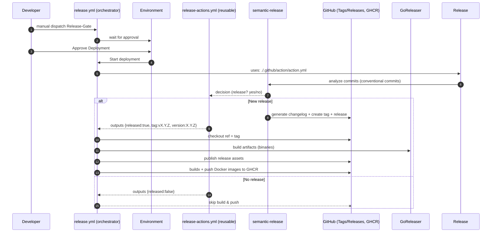

# Release

We use Github Action to release using [semantic-release](https://github.com/semantic-release/semantic-release)
and [goreleaser](https://goreleaser.com/).

## ReleaseFlow

## Artifacts

We release multiple artifacts:

| Type             | Arc                                      | Link                                                                   |
|------------------|------------------------------------------|------------------------------------------------------------------------|
| Docker Container | arm64 and amd64 for linux                | <https://github.com/Marcel2603/tfcoach/pkgs/container/tfcoach%2Ftfcoach> |
| Executable       | arm64 and amd64 for linux/darwin/windows | <https://github.com/Marcel2603/tfcoach/releases>                         |
